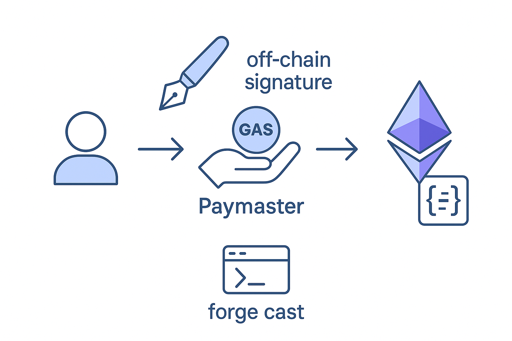

# Simple paymaster contract


<div align="center">
    
</div>

</br>
</br>

This repository demonstrates a simple sponsorship paymaster flow on Ethereum using *[eth-infinitism/account-abstraction v0.7.0](https://github.com/eth-infinitism/account-abstraction/tree/v0.7.0)* It provides a reference implementation for deploying the [`VerifyingPaymaster.sol`](contracts/SimplePaymaster.sol) contract and interacting with it via `forge cast` commands.

> [!IMPORTANT]
> `VerifyingPaymaster.sol` only includes the functionality to sponsor gas fees for users interacting with a Dapp. 
> It does not support payments using ERC20 tokens.

## Account Info
| name                 	| address                                    	| private key                                                        	|
|----------------------	|--------------------------------------------	|--------------------------------------------------------------------	|
| paymaster deployer 	| 0x55511cFf14093Cd85a3c36Ad3527369cBc8a5063 	| 0xfefcc139ed357999ed60c6a013947328d52e7d9751e93fd0274a2bfae5cbcb12 	|


## Deploy
1. Set the values shown in `.env.example` as environmental variables. To copy it into a `.env` file:

    ```
    cp .env.example .env
    ```

2. You'll still need to edit some variables, i.e., `PRIVATE_KEY`.
    ```
    # Your private key
    PRIVATE_KEY=

    # Provider Url
    PROVIDER_URL=
    ```

3. run deploy script
    ```
    yarn run deploy --network localhost

    # using create2
    yarn run deploy --network localhost --strategy create2

    # deploy custom network
    PRIVATE_KEY= -private key- \
    PROVIDER_URL= -Privider Url- \
    yarn run deploy --network custom

    # deploy custom network using create2
    PRIVATE_KEY= -private key- \
    PROVIDER_URL= -Privider Url- \
    SALT= -custom salt- \
    yarn run deploy --network custom --strategy create2

    ```

## CLI
#### deposit
```
cast send 0x064Fbec1c03eC4004E7f9ADc5FAe2e2fB1857064 \
"deposit() returns (uint256)" \
-r http://127.0.0.1:8545 \
--value 1ether \
--private-key 0xfefcc139ed357999ed60c6a013947328d52e7d9751e93fd0274a2bfae5cbcb12
```

#### getDeposit
```
cast call 0x064Fbec1c03eC4004E7f9ADc5FAe2e2fB1857064 \
"getDeposit() returns (uint256)" \
-r http://127.0.0.1:8545
```

#### entryPoint
```
cast call 0x064Fbec1c03eC4004E7f9ADc5FAe2e2fB1857064 \
"entryPoint() returns (address)" \
-r http://127.0.0.1:8545
```

#### owner
```
cast call 0x064Fbec1c03eC4004E7f9ADc5FAe2e2fB1857064 \
"owner() returns (address)" \
-r http://127.0.0.1:8545
```

#### verifyingSigner
```
cast call 0x064Fbec1c03eC4004E7f9ADc5FAe2e2fB1857064 \
"verifyingSigner() returns (address)" \
-r http://127.0.0.1:8545
```

## Optional: Deploy CreateX for using create2
[`CreateX`](https://github.com/pcaversaccio/createx/tree/main?tab=readme-ov-file) is a factory contract that enables deterministic deployment of smart contracts. If want to use Hardhat’s `Create2` with this contract locally, need to deploy it.  Do so using the CLI command below.

- Deployer : *0xeD456e05CaAb11d66C4c797dD6c1D6f9A7F352b5*
- Contract address : *0xba5Ed099633D3B313e4D5F7bdc1305d3c28ba5Ed*

1. send transaction fee to CreateX deployer
    ```
    cast send 0xeD456e05CaAb11d66C4c797dD6c1D6f9A7F352b5 \
    --value 300000000000000000 \
    -r http://127.0.0.1:8545 \
    --private-key 0xfefcc139ed357999ed60c6a013947328d52e7d9751e93fd0274a2bfae5cbcb12
    ```

2. deploy createx contract
    ```
    npm run deploy:creatx http://127.0.0.1:8545 0xfefcc139ed357999ed60c6a013947328d52e7d9751e93fd0274a2bfae5cbcb12
    ```

